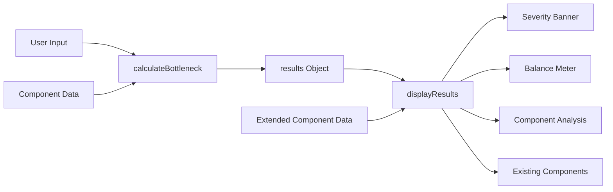
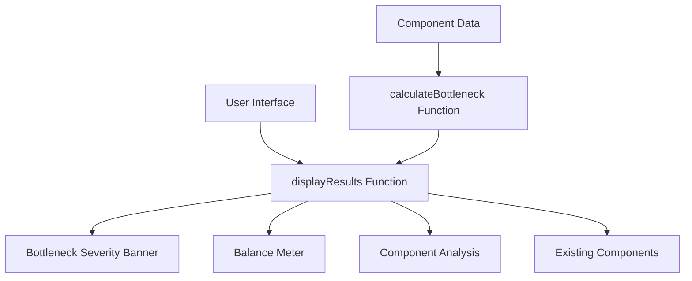
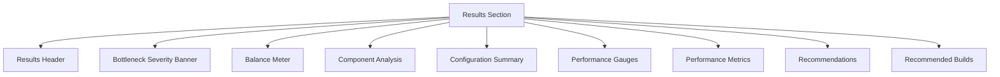

# PC Bottleneck Calculator - Phase 1 Implementation Design

## Overview
This document outlines the design for implementing Phase 1 features of the PC Bottleneck Calculator. Based on the analysis in Phases.md, Phase 1 focuses on implementing the core missing features: Bottleneck Severity Banner, Balance Meter Visualization, and Enhanced Component Analysis Section.

The current implementation already includes:
- Component selection interface with CPU/GPU dropdowns
- Advanced configuration options
- Performance gauges for CPU/GPU bottleneck visualization
- Performance metrics (Avg FPS, Max FPS, 1% Lows)
- Basic recommendations
- Recommended builds section

Phase 1 will enhance the results section with more detailed visualizations and analysis.

## Architecture
The PC Bottleneck Calculator is a client-side web application built with HTML, CSS, and vanilla JavaScript. It uses Chart.js for data visualization. The application follows a modular architecture where:

1. **Data Layer**: Component databases (CPUs, GPUs, Games) stored as JavaScript objects
2. **Business Logic Layer**: Calculation engine that determines bottlenecks and performance metrics
3. **Presentation Layer**: HTML/CSS/JavaScript UI that displays results and handles user interactions

For Phase 1 implementation, we'll be enhancing the presentation layer by adding new UI components and modifying the `displayResults` function to populate these components with data from the existing business logic.

### Data Flow



The data flows from user input through the calculation engine to the display function, which then populates all result components including the new Phase 1 features.

### Component Relationships



The `displayResults` function orchestrates the population of all result components using data from the `calculateBottleneck` function and the component database.

## Component Design

### 1. Bottleneck Severity Banner
A color-coded banner that prominently displays the overall bottleneck severity.

#### Properties:
- Color coding based on severity (green: balanced, yellow: mild bottleneck, red: significant bottleneck)
- Large display of bottleneck percentage
- Descriptive title (e.g., "Significant CPU Bottleneck")
- Detailed description of what the bottleneck means
- Resolution information

#### Implementation Plan:
- Add new HTML element in results section after the results-header
- Create CSS classes for different severity levels
- Modify `displayResults` function to populate banner with:
  - Overall bottleneck percentage (higher of CPU/GPU bottleneck values)
  - Severity title based on percentage thresholds
  - Descriptive text explaining the bottleneck
  - Selected resolution

#### Severity Calculation Logic:

1. **Overall Bottleneck Percentage**: 
   - Use `Math.max(results.cpuBottleneck, results.gpuBottleneck)`
   
2. **Severity Thresholds**:
   - 0-10%: Well Balanced (Green)
   - 11-25%: Mild Bottleneck (Yellow)
   - 26%+: Significant Bottleneck (Red)
   
3. **Severity Title Generation**:
   - If CPU bottleneck is higher: "Significant CPU Bottleneck"
   - If GPU bottleneck is higher: "Significant GPU Bottleneck"
   - If balanced: "Well Balanced System"

### 2. Balance Meter Visualization
An interactive meter with color gradient showing system balance between CPU and GPU.

#### Properties:
- Horizontal meter with color gradient (red → yellow → green → yellow → red)
- Position marker indicating current balance point
- Labels for "CPU Bottleneck", "Optimal Balance", and "GPU Bottleneck"
- Legend explaining color coding

#### Implementation Plan:
- Add new HTML element in results section after the severity banner
- Create CSS for gradient meter and position marker
- Implement JavaScript function to:
  - Calculate balance point based on CPU/GPU scores
  - Position marker on the meter
  - Determine color at marker position
- Add labels and legend

### 3. Enhanced Component Analysis Section
Detailed breakdown for CPU and GPU with technical specifications.

#### Properties:
- Separate sections for CPU and GPU analysis
- Component header with name and model
- Benchmark scores and rankings
- Resolution impact explanation
- Performance assessment with visual indicators
- Technical specifications (core count, VRAM, etc.)

#### Implementation Plan:
- Add new HTML elements in results section after the balance meter
- Extend component data structure to include technical specs
- Modify `displayResults` function to populate detailed analysis for:
  - CPU specifications (core count, thread count, etc.)
  - GPU specifications (VRAM, etc.)
  - Benchmark scores and rankings
  - Resolution impact information
  - Performance assessment indicators

## Data Models

### Component Data Extension
The existing component data structure needs to be extended with technical specifications:

```javascript
// CPU data extension
const cpus = [
  { id: "ryzen-5-5600", name: "AMD Ryzen 5 5600", score: 14500, rank: 12, coreCount: 6, threadCount: 12, baseClock: "3.5 GHz", boostClock: "4.4 GHz", tdp: "65W" },
  { id: "ryzen-7-5700x", name: "AMD Ryzen 7 5700X", score: 15800, rank: 5, coreCount: 8, threadCount: 16, baseClock: "3.4 GHz", boostClock: "4.6 GHz", tdp: "65W" },
  { id: "i5-12600k", name: "Intel Core i5-12600K", score: 16200, rank: 4, coreCount: 6, threadCount: 12, baseClock: "3.7 GHz", boostClock: "4.9 GHz", tdp: "125W" },
  { id: "i7-12700k", name: "Intel Core i7-12700K", score: 17500, rank: 3, coreCount: 8, pCoreCount: 6, eCoreCount: 4, threadCount: 20, baseClock: "3.6 GHz", boostClock: "5.0 GHz", tdp: "125W" },
  { id: "ryzen-7-7800x3d", name: "AMD Ryzen 7 7800X3D", score: 17500, rank: 1, coreCount: 8, threadCount: 16, baseClock: "4.2 GHz", boostClock: "5.0 GHz", tdp: "120W" },
  { id: "i9-13900k", name: "Intel Core i9-13900K", score: 18500, rank: 1, coreCount: 8, pCoreCount: 8, eCoreCount: 16, threadCount: 24, baseClock: "3.0 GHz", boostClock: "5.8 GHz", tdp: "125W" },
  { id: "ryzen-9-7950x3d", name: "AMD Ryzen 9 7950X3D", score: 16800, rank: 2, coreCount: 16, threadCount: 32, baseClock: "4.2 GHz", boostClock: "5.0 GHz", tdp: "120W" },
  { id: "i5-13600k", name: "Intel Core i5-13600K", score: 16800, rank: 2, coreCount: 6, pCoreCount: 6, eCoreCount: 8, threadCount: 20, baseClock: "3.5 GHz", boostClock: "5.1 GHz", tdp: "125W" }
];

// GPU data extension
const gpus = [
  { id: "rtx-3060", name: "NVIDIA RTX 3060", score: 12500, fps1080: 145, fps1440: 115, fps4k: 65, rank: 25, vram: "12GB GDDR6", busInterface: "PCIe 4.0 x16", tdp: "170W" },
  { id: "rtx-4060", name: "NVIDIA RTX 4060", score: 12500, fps1080: 145, fps1440: 115, fps4k: 65, rank: 25, vram: "8GB GDDR6", busInterface: "PCIe 4.0 x16", tdp: "115W" },
  { id: "rtx-4070", name: "NVIDIA RTX 4070", score: 16800, fps1080: 185, fps1440: 155, fps4k: 90, rank: 4, vram: "12GB GDDR6X", busInterface: "PCIe 4.0 x16", tdp: "200W" },
  { id: "rtx-4080", name: "NVIDIA RTX 4080", score: 22000, fps1080: 230, fps1440: 200, fps4k: 130, rank: 3, vram: "16GB GDDR6X", busInterface: "PCIe 4.0 x16", tdp: "320W" },
  { id: "rtx-4090", name: "NVIDIA RTX 4090", score: 37000, fps1080: 370, fps1440: 310, fps4k: 210, rank: 2, vram: "24GB GDDR6X", busInterface: "PCIe 4.0 x16", tdp: "450W" },
  { id: "rx-7600", name: "AMD RX 7600", score: 11200, fps1080: 135, fps1440: 105, fps4k: 58, rank: 30, vram: "8GB GDDR6", busInterface: "PCIe 4.0 x16", tdp: "165W" },
  { id: "rx-7900xt", name: "AMD RX 7900 XT", score: 29000, fps1080: 290, fps1440: 250, fps4k: 165, rank: 3, vram: "20GB GDDR6", busInterface: "PCIe 4.0 x16", tdp: "250W" },
  { id: "gtx-1660-super", name: "NVIDIA GTX 1660 Super", score: 8500, fps1080: 95, fps1440: 68, fps4k: 38, rank: 45, vram: "6GB GDDR6", busInterface: "PCIe 3.0 x16", tdp: "125W" }
];
```

## UI/UX Design

### Layout Structure
The new components will be added to the results section in this order:
1. Results Header (existing)
2. Bottleneck Severity Banner
3. Balance Meter Visualization
4. Enhanced Component Analysis (CPU and GPU sections)
5. Configuration Summary (existing)
6. Performance Gauges (existing)
7. Performance Metrics (existing)
8. Recommendations (existing)
9. Recommended Builds (existing)

### UI Layout Structure



### Color Scheme
- Green (balanced): #4CAF50
- Yellow (mild bottleneck): #FFB300
- Red (significant bottleneck): #E53935
- Gradient for balance meter: Red (#E53935) → Yellow (#FFB300) → Green (#4CAF50) → Yellow (#FFB300) → Red (#E53935)

### Responsive Design
All new components will follow the existing responsive design patterns using CSS Grid and Flexbox.

## Integration Points

### JavaScript Functions to Modify
1. `displayResults(results, cpu, gpu, resolution)` - Main function that populates results section
2. `calculateBottleneck(cpu, gpu, resolution, advanced)` - May need enhancements for balance calculation

### CSS Classes to Add
- `.severity-banner` - Container for bottleneck severity banner
- `.balance-meter` - Container for balance meter visualization
- `.component-analysis` - Container for component analysis sections
- Severity-specific classes (`.severity-low`, `.severity-medium`, `.severity-high`)

### CSS Structure

The new CSS will follow the existing design patterns with:

1. **Consistent Color Scheme**:
   - Green (#4CAF50) for balanced systems
   - Yellow (#FFB300) for mild bottlenecks
   - Red (#E53935) for significant bottlenecks

2. **Responsive Design**:
   - Flexbox and Grid layouts
   - Media queries for mobile responsiveness
   - Consistent spacing and typography

3. **Visual Hierarchy**:
   - Clear section headings
   - Appropriate font sizes and weights
   - Proper spacing between elements

### HTML Elements to Add
New sections in the results area:
- `<div id="severity-banner">` for bottleneck severity banner
- `<div id="balance-meter">` for balance visualization
- `<div id="component-analysis">` for detailed component breakdowns

## Implementation Approach

The implementation will follow this sequence:

1. **Extend Component Data**: Add technical specifications to existing CPU and GPU data structures
2. **Add HTML Structure**: Insert new HTML elements in the results section
3. **Add CSS Styling**: Create CSS classes for new components
4. **Enhance JavaScript Logic**: Modify `displayResults` function to populate new components
5. **Testing**: Verify functionality and integration

### 1. Extend Component Data
First, we'll enhance the existing component data arrays with technical specifications as shown in the Data Models section.

### 2. Add HTML Structure
We'll insert the new components in the appropriate locations within the results section:
- Severity Banner after the results-header
- Balance Meter after the severity banner
- Component Analysis section after the balance meter

### 3. Add CSS Styling
We'll add new CSS classes for:
- Severity banner styling with color coding
- Balance meter visualization
- Component analysis sections

### 4. Enhance JavaScript Logic
We'll modify the `displayResults` function to:
- Calculate overall bottleneck severity
- Determine balance point between CPU and GPU
- Populate component analysis sections with detailed specs

For the balance meter, we'll implement the following calculation logic:

1. **Balance Point Calculation**: 
   - Use the ratio of CPU score to GPU score
   - Normalize this ratio to a position on the meter (0-100 scale)
   - Center position (50) represents optimal balance
   - Positions < 50 indicate CPU bottleneck
   - Positions > 50 indicate GPU bottleneck

2. **Position Mapping**:
   - If CPU score > GPU score: position = 50 - (50 * (CPU/GPU - 1))
   - If GPU score > CPU score: position = 50 + (50 * (GPU/CPU - 1))
   - If scores are equal: position = 50

3. **Color Determination**:
   - Calculate color based on position on the gradient
   - Use linear interpolation between colors in the gradient

### 5. Testing
We'll verify that:
- New components display correctly
- Data is accurately populated
- Color coding works as expected
- Responsive design is maintained

## Testing Strategy

### Unit Tests
1. Test color coding logic for different bottleneck percentages
2. Test balance meter positioning algorithm
3. Test component analysis data population

### Integration Tests
1. Verify all new components display correctly after calculation
2. Ensure responsive design works on different screen sizes
3. Test that existing functionality remains unaffected

### User Acceptance Tests
1. Validate that severity banner correctly reflects bottleneck severity
2. Confirm balance meter accurately represents CPU/GPU balance
3. Check that component analysis provides useful technical details

## Error Handling

The implementation will include error handling for:

1. **Missing Data**: Graceful handling of missing technical specifications
2. **Calculation Errors**: Validation of balance calculations
3. **Display Issues**: Fallbacks for visualization problems
4. **Browser Compatibility**: Ensuring functionality across different browsers

Error messages will be displayed in a user-friendly manner without breaking the existing functionality.

## Performance Considerations

1. **Minimal DOM Manipulation**: Efficient updating of new components
2. **Optimized Calculations**: Cached values where appropriate
3. **Lightweight Visualizations**: CSS-based visualizations where possible
4. **Non-blocking Operations**: Ensuring calculations don't block the UI thread

## Browser Compatibility

The implementation will maintain compatibility with:

1. **Modern Browsers**: Chrome, Firefox, Safari, Edge (latest two versions)
2. **CSS Features**: Flexbox, Grid, CSS Variables
3. **JavaScript Features**: ES6+ features used in the existing codebase
4. **Canvas API**: For the balance meter visualization

Fallbacks will be provided for older browsers where necessary.

## Deployment

The implementation will be deployed by:

1. **Adding Extended Component Data**: Updating the component arrays with technical specifications
2. **Adding HTML Elements**: Inserting new sections in the results area
3. **Adding CSS**: Including new styles in the existing style tag
4. **Updating JavaScript**: Modifying the `displayResults` function
5. **Testing**: Verifying functionality in different browsers

No external dependencies will be added, maintaining the single-file nature of the application.